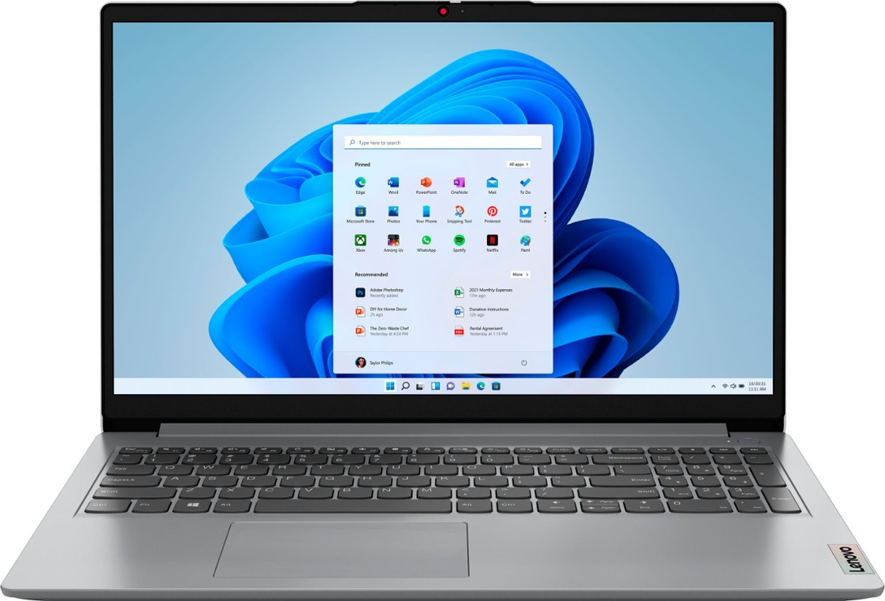

# Laptop Recommendations for CFO

## Introduction
In this project, I present two laptop options for the Chief Financial Officer (CFO) to consider for ordering 200 new laptops for the organization. After comparing the CFO's requested laptop with two alternative options, I recommend the [Lenovo IdeaPad 3i](https://www.example.com/lenovo-ideapad-3i) as the preferred choice. Additionally, the [Dell Inspiron](https://www.example.com/dell-inspiron) can be considered as an alternative option. Below are the details of the recommended laptops:

### CFO's Requested Laptop
- Laptop Model: Lenovo IdeaPad 3
- Price: $599.99
- CPU: AMD Athlon Silver 7120U
- Number of Processors: Information not provided
- RAM: 4GB
- Hard Drive Storage: 128GB SSD
  
### Alternative Laptop Option 1 (Recommended)
- Laptop Model: Lenovo IdeaPad 3i
- Price: $699.99
- CPU: Intel Core i5-1135G7
- Number of Processors: Quad-core
- RAM: 16GB
- Hard Drive Storage: 512GB SSD
- [Alternative Laptop Option 1 Image](OPT1.jpg)

### Alternative Laptop Option 2
- Laptop Model: Dell Inspiron
- Price: $699.99
- CPU: AMD Ryzen 7 7000 Series
- Number of Processors: 8-core
- RAM: 16GB
- Hard Drive Storage: 1TB SSD
- [Alternative Laptop Option 2 Image](OPT2.jpg)

## Reasons for Recommendation
1. Improved CPU Performance: Both the Lenovo IdeaPad 3i and Dell Inspiron offer better CPU performance compared to the AMD Athlon Silver 7120U in the CFO's requested laptop.
2. More RAM: The Lenovo IdeaPad 3i and Dell Inspiron come with 16GB of RAM, providing better multitasking capabilities compared to the 4GB in the CFO's requested laptop.
3. Larger Storage Capacity: The Dell Inspiron offers a 1TB SSD, providing ample storage space for files and applications.

## Conclusion
Considering the improved CPU performance, increased RAM, and larger storage capacity, I recommend the Lenovo IdeaPad 3i as the preferred laptop for the organization. However, if the budget allows for a higher-end option, the Dell Inspiron is also a viable choice. Both options offer better specifications and enhanced productivity.

